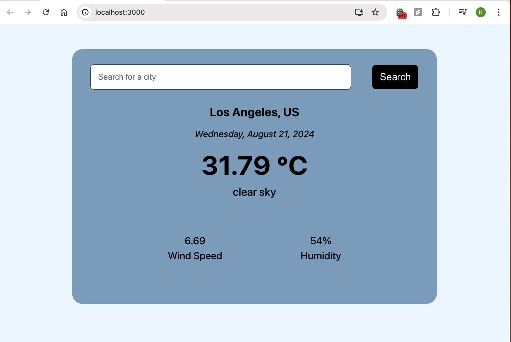

# Weather App in React

This is a simple weather application built using React that allows users to search for a city's weather. It fetches real-time weather data from the OpenWeatherMap API and displays it in a clean, user-friendly interface. The temperature is displayed in Celsius along with other weather details like wind speed and humidity.

## Features
- Search for the weather in any city
- Displays temperature in Celsius
- Shows wind speed and humidity
- Responsive design

## Screenshot


## Installation

1. Clone the repository:
   ```bash
   git clone https://github.com/your-username/weather-app-react.git